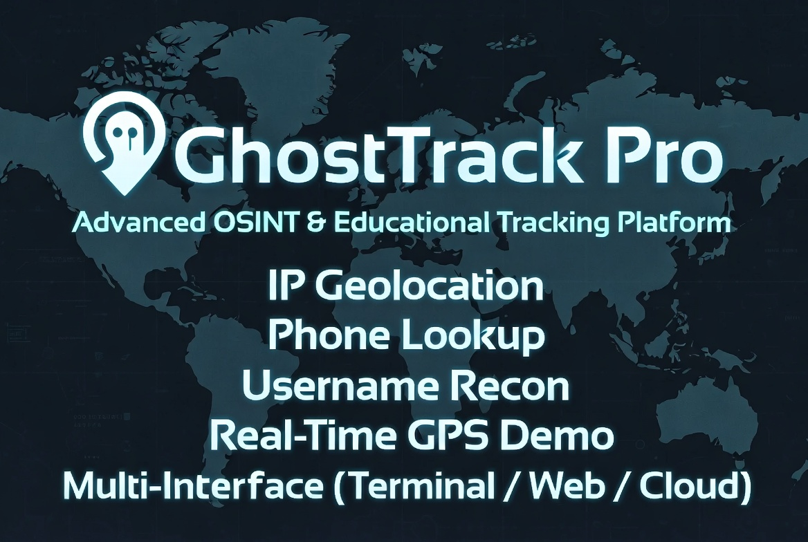

<p align="center">
  <a href="https://ghosttrackerpro.vercel.app">
    
  </a>
</p>

<p align="center">
  
  
  
  
  
</p>

<p align="center">
  
</p>


<h1 align="center">
  GhostTrack Pro
</h1>
<p align="center">
  <strong>Advanced OSINT & Educational Tracking Toolkit</strong>
  <br>
  <sub>IP Tracking · Phone Intel · Username OSINT · Subdomain Enum · DNS · WHOIS · Port Scan · URL/Header Analysis · SSL Check · Hash Lookup · Breach Check · Bulk Ops · GPS Capture</sub>
</p>

<p align="center">
  <br>
  <a href="#features">Features</a> •
  <a href="#installation">Installation</a> •
  <a href="#usage">Usage</a> •
  <a href="#web-interface">Web UI</a> •
  <a href="#deploy-to-vercel">Vercel</a> •
  <a href="#api-documentation">API</a> •
  <a href="#architecture">Architecture</a>
</p>

<p align="center">
  <sub>
    <strong>Live Demo:</strong>
    <a href="https://ghosttrackerpro.vercel.app">ghosttrackerpro.vercel.app</a>
    &nbsp;&nbsp;|&nbsp;&nbsp;
    <strong>Repo:</strong>
    <a href="https://github.com/Hamza35779/GhostTrackerPro">github.com/Hamza35779/GhostTrackerPro</a>
  </sub>
</p>

---

**GhostTrack Pro** is a full-stack OSINT (Open Source Intelligence) reconnaissance and educational tracking platform designed for cybersecurity professionals, penetration testers, digital forensics researchers, and ethical hackers. It integrates five intelligence-gathering modules into a unified toolkit that can be operated via three distinct interfaces — terminal, local web browser, or globally deployed cloud instance.

### What It Does

GhostTrack Pro collects publicly available information from multiple sources to paint a picture of a target's digital footprint:

| Module | Data Collected | Source |
|---|---|---|
| **IP Address Intelligence** | Geolocation, ISP, org, coordinates, flag, type | ipwho.is API |
| **Phone Number Analysis** | Carrier, region, timezone, validity, country | Google libphonenumber |
| **Username OSINT** | Cross-platform presence (20 platforms) | Direct HTTP checks |
| **Subdomain Enumeration** | Discover subdomains via SSL cert logs | crt.sh Certificate Transparency |
| **DNS Lookup** | A, AAAA, MX, NS, TXT, CNAME, SOA records | System nslookup + socket |
| **WHOIS Lookup** | Registrant, created/expiry dates, nameservers, DNSSEC | RDAP (Verisign) |
| **Port Scanner** | Open TCP ports on 27 common ports | Threaded socket connections |
| **URL / Header Analyzer** | Security headers, redirect chain, server info, status | HTTP requests |
| **SSL Certificate Checker** | Subject, issuer, expiry, version, validity | Python ssl module |
| **Hash Lookup** | Reverse MD5, SHA1, SHA256 | Public rainbow table APIs |
| **Email Breach Check** | HIBP k-anonymity breach detection | haveibeenpwned.com API |
| **IP Reputation** | VPN, proxy, TOR detection, threat level | ipwho.is security data |
| **Bulk Lookup** | Process multiple IPs or phones at once | Batch core lookups |
| **Live GPS Capture** | Real-time lat/lon, accuracy, IP | Browser Geolocation API |
| **My IP** | Your public IP, ISP, city, country | ipify.org + ipwho.is |

### Why Use It

- **All-in-one** — 15+ modules in a single toolkit covering recon, analysis, security, and utilities
- **Three interfaces** — Use the terminal, a local web UI, or deploy to the cloud
- **Auto-logging** — Every result is timestamped and saved to `logs/` automatically
- **Extensible architecture** — `core.py` contains all logic; adding new data sources is straightforward
- **Educational** — Demonstrates how easily location data can be phished and how much OSINT data is publicly available

<p align="center">
  
</p>

### How to Interact

```
┌──────────────────────────────────────────────────────────────────┐
│                        GhostTrack Pro                            │
├──────────────────────────────────────────────────────────────────┤
│                                                                  │
│  ┌─────────────────────┐  ┌──────────────────┐  ┌─────────────┐ │
│  │  Terminal CLI        │  │  Local Web UI    │  │  Vercel     │ │
│  │  python3 app.py --ip │  │  :8080           │  │  .vercel.app│ │
│  │                      │  │                  │  │             │ │
│  │  • 15 modules        │  │  • 16 tool pages  │  │  • Cloud    │ │
│  │  • CLI flags (15+)   │  │  • Dark theme    │  │  • Public   │ │
│  │  • GPS server :5000  │  │  • REST API      │  │  • Serverless│ │
│  └─────────────────────┘  └──────────────────┘  └─────────────┘ │
│                                                                  │
│         All three share the same core.py backend                 │
└──────────────────────────────────────────────────────────────────┘
```

All three interfaces share the same backend logic in `core.py`, so results are identical regardless of how you run the tool. The CLI is best for quick lookups in the terminal, the local web UI provides a richer visual experience, and the Vercel deployment makes the toolkit accessible from any device with a browser.

---

## Disclaimer

> **This tool is for educational purposes and authorized testing only.**
> - Do **not** use this to track individuals without their explicit consent.
> - Unauthorized tracking may violate privacy laws (GDPR, CFAA, etc.) in your jurisdiction.
> - The developer is **not responsible** for any misuse of this tool.
> - The GPS capture feature works via a phishing-style link — use it **only** on your own devices or with written permission.

---

## Features

### 1. IP Address Intelligence
Retrieve public registration data for any IPv4 address via the [ipwho.is](https://ipwho.is) API.

| Field | Description |
|---|---|
| IP Address | The queried address |
| Type | IPv4 / IPv6 |
| Country | Registered country |
| City | Registered city |
| Region | State or region |
| ISP | Internet Service Provider |
| Organization | Owning organization |
| Coordinates | Approximate latitude/longitude |

**Limitation:** IP geolocation shows the ISP's registered location, not the user's physical address. It cannot identify a specific person or house.

---

### 2. Phone Number Intelligence
Analyze phone numbers for carrier, region, and validity using the [phonenumbers](https://github.com/daviddrysdale/python-phonenumbers) library (Google's libphonenumber).

| Field | Description |
|---|---|
| Country Code | International dialing code |
| National Number | Formatted local number |
| Registered Location | Geographic region of the carrier |
| Carrier / Operator | Mobile network operator |
| Timezone | Timezone(s) associated with the number |
| Valid Number | Whether the number format is valid |

**Limitation:** This provides carrier registration data only — not real-time GPS location. Real-time tracking requires the GPS capture module or legal interception.

---

### 3. Username OSINT
Check the existence of a username across major social media platforms.

| Platform | URL Pattern |
|---|---|---|
| Instagram | `https://instagram.com/{username}/` |
| Facebook | `https://facebook.com/{username}` |
| Twitter / X | `https://twitter.com/{username}` |
| GitHub | `https://github.com/{username}` |
| Reddit | `https://reddit.com/user/{username}` |
| TikTok | `https://tiktok.com/@{username}` |
| Pinterest | `https://pinterest.com/{username}/` |
| LinkedIn | `https://linkedin.com/in/{username}/` |
| YouTube | `https://youtube.com/@{username}` |
| Snapchat | `https://snapchat.com/add/{username}` |
| Telegram | `https://t.me/{username}` |
| Twitch | `https://twitch.tv/{username}` |
| Medium | `https://medium.com/@{username}` |
| Steam | `https://steamcommunity.com/id/{username}` |
| DeviantArt | `https://deviantart.com/{username}` |
| Behance | `https://behance.net/{username}` |
| Keybase | `https://keybase.io/{username}` |
| Mastodon | `https://mastodon.social/@{username}` |
| SoundCloud | `https://soundcloud.com/{username}` |
| Spotify | `https://open.spotify.com/user/{username}` |

Results are categorized as **Found**, **Not Found**, or **Blocked** (rate-limited / captcha). Some platforms may return false positives due to anti-bot measures.

---

### 4. Live GPS Tracker (Educational)

<p align="center">
  
</p>

Creates a local Flask web server that hosts a fake "Security Alert" page. When the target visits the link and clicks **"Verify & Secure Device"**, the browser's Geolocation API sends their coordinates to your terminal.

**Technical flow:**
1. Start the server on port 5000
2. Victim visits `http://your-ip:5000`
3. Page requests location permission
4. On acceptance, coordinates are sent to `/capture` endpoint
5. Data is printed to terminal and saved to `logs/`

**Requirements:** For remote targets, use a tunneling service (Ngrok, LocalXpose, Cloudflare Tunnel) to expose port 5000.

---

### 5. Web Interface (Browser UI)

A single-page web application with a dark navy/cyan theme, card-based dashboard, and real-time API responses:

- **Dashboard** — banner + card grid for all 16 modules
- IP Tracker — geolocation table with flag emoji, map link
- Phone Tracker — international/national formatting, validity badge
- Username Tracker — per-platform status badges with counters
- Subdomain Enum — scrollable subdomain list with count
- DNS Lookup — A, AAAA, MX, NS, TXT, CNAME, SOA sections
- WHOIS Lookup — grid layout with registrant, dates, DNSSEC
- Port Scanner — open port badges with service names
- URL Analyzer — security header audit, raw headers toggle, redirect chain
- SSL Checker — subject/issuer/expiry with valid/invalid badge
- Hash Lookup — type detection, decrypted output display
- Email Breach — HIBP breach results with count
- IP Reputation — VPN/proxy/TOR status badges
- My IP — one-click public IP lookup
- Bulk Lookup — multi-line input for IPs and phones
- GPS Tracker — setup instructions
- Logs Browser — scrollable log entries with preview

---

### 6. Auto-Save & Logging

Every result is automatically saved to `logs/` as a timestamped text file:

```
logs/
├── IP_TRACK_2026-07-05_14-30-22.txt
├── PHONE_TRACK_2026-07-05_14-31-05.txt
├── USERNAME_TRACK_2026-07-05_14-32-10.txt
└── GPS_CAPTURE_2026-07-05_14-33-00.txt
```

In CLI flag mode and web mode, saving is automatic. In interactive menu mode, you are prompted before saving.

---

## Installation

### Requirements

- **Python 3.8+**
- **pip** (Python package manager)
- **Operating System:** Linux (Kali, Ubuntu, Parrot), macOS, or Android (Termux)

### Linux (Kali / Ubuntu / Parrot)

```bash
sudo apt update && sudo apt upgrade -y
sudo apt install python3-pip git -y
git clone https://github.com/Hamza35779/GhostTrackerPro.git
cd GhostTrackerPro
pip3 install -r requirements.txt
python3 GhostTrackerPro.py
```

### macOS

```bash
# Install Python if needed: brew install python
git clone https://github.com/Hamza35779/GhostTrackerPro.git
cd GhostTrackerPro
pip3 install -r requirements.txt
python3 GhostTrackerPro.py
```

### Termux (Android)

> **Important:** Do not use the Play Store version of Termux — it is outdated. Download from [F-Droid](https://f-droid.org/en/packages/com.termux/) or the [official GitHub](https://github.com/termux/termux-app).

```bash
pkg update && pkg upgrade
pkg install python git
git clone https://github.com/Hamza35779/GhostTrackerPro.git
cd GhostTrackerPro
pip install -r requirements.txt
python GhostTrackerPro.py
```

### Verify Installation

```bash
python3 GhostTrackerPro.py --myip
# Expected output: Your public IP address with ISP and location
```

---

## Usage

### Interactive Menu

```bash
python3 GhostTrackerPro.py
```

```
  ── RECONNAISSANCE ──
  [ 1] IP Tracker
  [ 2] Phone Number Tracker
  [ 3] Username Tracker
  [ 4] Subdomain Enumeration
  [ 5] DNS Lookup
  [ 6] WHOIS Lookup

  ── ANALYSIS ──
  [ 7] Port Scanner
  [ 8] URL / Header Analyzer
  [ 9] SSL Certificate Checker
  [10] Hash Lookup
  [11] Email Breach Check

  ── SECURITY ──
  [12] IP Reputation Check
  [13] Show My IP

  ── UTILITIES ──
  [14] Bulk Lookup (IP/Phone)
  [15] Web Interface
  [16] Live GPS Tracker
  [17] View Saved Logs

  [ 0] Exit
```

### Command-Line Flags

```bash
# IP lookup
python3 GhostTrackerPro.py --ip 8.8.8.8

# Phone lookup
python3 GhostTrackerPro.py --phone +14155552671

# Username search
python3 GhostTrackerPro.py --username johndoe

# Subdomain enumeration
python3 GhostTrackerPro.py --domain example.com --subdomain

# DNS lookup
python3 GhostTrackerPro.py --domain example.com --dns

# WHOIS lookup
python3 GhostTrackerPro.py --domain example.com --whois

# Port scan
python3 GhostTrackerPro.py --host scanme.org --portscan

# URL analysis
python3 GhostTrackerPro.py --url https://example.com --analyze

# SSL certificate check
python3 GhostTrackerPro.py --hostname google.com --ssl

# Hash reverse lookup
python3 GhostTrackerPro.py --hash 5d41402abc4b2a76b9719d911017c592

# Email breach check
python3 GhostTrackerPro.py --email user@example.com --breach

# IP reputation
python3 GhostTrackerPro.py --reputation 8.8.8.8

# Your public IP
python3 GhostTrackerPro.py --myip

# GPS capture server
python3 GhostTrackerPro.py --gps

# Web interface
python3 GhostTrackerPro.py --web

# Help
python3 GhostTrackerPro.py --help
```

---

## Web Interface

Start the local web UI and open `http://localhost:8080` in your browser.

```bash
# From CLI menu
python3 GhostTrackerPro.py   # then select option 6

# From command line
python3 GhostTrackerPro.py --web

# Directly
python3 web/server.py
```

The web interface auto-detects your local network IP and displays it for sharing with other devices on your LAN.

---

## Deploy to Vercel

The web interface is live at:

<p align="center">
  <a href="https://ghosttrackerpro.vercel.app"><strong>https://ghosttrackerpro.vercel.app</strong></a>
</p>

### Deploy Your Own Instance

The project uses **zero-configuration Flask detection** — Vercel automatically detects `requirements.txt` and `app.py`.

**Option 1 — One-click:**
[](https://vercel.com/new/clone?repository-url=https://github.com/Hamza35779/GhostTrackerPro)

**Option 2 — CLI:**
```bash
npm i -g vercel
git clone https://github.com/Hamza35779/GhostTrackerPro.git
cd GhostTrackerPro
vercel --prod
```

**Notes:**
- Logs use `/tmp/logs` (ephemeral — cleared between requests)
- GPS tracker (`--gps`) runs locally only — not on Vercel
- Python version: 3.12 (set via `.python-version`)

---

## API Documentation

The Flask backend exposes a REST API at `/api/*`. All endpoints return JSON.

### `GET /api/my-ip`

Returns your public IP and optional ISP/location data.

```bash
curl https://ghosttrackerpro.vercel.app/api/my-ip
```

```json
{
  "success": true,
  "data": {
    "ip": "20.192.21.48",
    "isp": "Microsoft Corporation",
    "country": "India",
    "city": "Pune"
  }
}
```

### `POST /api/ip-track`

Look up an IP address.

```bash
curl -X POST https://ghosttrackerpro.vercel.app/api/ip-track \
  -H "Content-Type: application/json" \
  -d '{"ip": "8.8.8.8"}'
```

```json
{
  "success": true,
  "data": {
    "ip": "8.8.8.8",
    "type": "IPv4",
    "country": "United States",
    "city": "Mountain View",
    "region": "California",
    "isp": "Google LLC",
    "organization": "Google LLC",
    "latitude": 37.3860517,
    "longitude": -122.0838511,
    "_saved": { "success": true, "path": "/tmp/logs/IP_TRACK_..." }
  }
}
```

### `POST /api/phone-track`

Analyze a phone number.

```bash
curl -X POST https://ghosttrackerpro.vercel.app/api/phone-track \
  -H "Content-Type: application/json" \
  -d '{"phone": "+14155552671"}'
```

```json
{
  "success": true,
  "data": {
    "phone": "+14155552671",
    "country_code": "+1",
    "national_number": "(415) 555-2671",
    "location": "San Francisco, CA",
    "carrier": "N/A",
    "timezone": "America/Los_Angeles",
    "is_valid": true,
    "_saved": { "success": true, "path": "/tmp/logs/PHONE_TRACK_..." }
  }
}
```

### `POST /api/username-track`

Search a username across social media.

```bash
curl -X POST https://ghosttrackerpro.vercel.app/api/username-track \
  -H "Content-Type: application/json" \
  -d '{"username": "github"}'
```

```json
{
  "success": true,
  "data": {
    "username": "github",
    "results": [
      { "platform": "Instagram", "url": "https://www.instagram.com/github/", "status": "found" },
      { "platform": "GitHub", "url": "https://github.com/github", "status": "found" },
      { "platform": "Facebook", "url": "https://www.facebook.com/github", "status": "blocked", "code": 400 }
    ],
    "_saved": { "success": true, "path": "/tmp/logs/USERNAME_TRACK_..." }
  }
}
```

### `GET /api/logs`

Retrieve up to 50 most recent saved log entries.

```bash
curl https://ghosttrackerpro.vercel.app/api/logs
```

### `POST /api/subdomain-enum`

Enumerate subdomains via Certificate Transparency logs.

```bash
curl -X POST https://ghosttrackerpro.vercel.app/api/subdomain-enum \
  -H "Content-Type: application/json" \
  -d '{"domain": "example.com"}'
```

### `POST /api/dns-lookup`

Fetch DNS records (A, AAAA, MX, NS, TXT, CNAME, SOA).

```bash
curl -X POST https://ghosttrackerpro.vercel.app/api/dns-lookup \
  -H "Content-Type: application/json" \
  -d '{"domain": "example.com"}'
```

### `POST /api/whois`

Domain WHOIS lookup via RDAP.

```bash
curl -X POST https://ghosttrackerpro.vercel.app/api/whois \
  -H "Content-Type: application/json" \
  -d '{"domain": "google.com"}'
```

### `POST /api/port-scan`

Scan 27 common TCP ports on a host.

```bash
curl -X POST https://ghosttrackerpro.vercel.app/api/port-scan \
  -H "Content-Type: application/json" \
  -d '{"host": "scanme.nmap.org"}'
```

### `POST /api/url-analyze`

Analyze URL for security headers, redirects, server info.

```bash
curl -X POST https://ghosttrackerpro.vercel.app/api/url-analyze \
  -H "Content-Type: application/json" \
  -d '{"url": "https://example.com"}'
```

### `POST /api/ssl-check`

Check SSL/TLS certificate details.

```bash
curl -X POST https://ghosttrackerpro.vercel.app/api/ssl-check \
  -H "Content-Type: application/json" \
  -d '{"hostname": "google.com"}'
```

### `POST /api/hash-lookup`

Reverse MD5, SHA1, or SHA256 hash lookup.

```bash
curl -X POST https://ghosttrackerpro.vercel.app/api/hash-lookup \
  -H "Content-Type: application/json" \
  -d '{"hash": "5d41402abc4b2a76b9719d911017c592"}'
```

### `POST /api/email-breach`

Check if an email appears in known data breaches (HIBP k-anonymity).

```bash
curl -X POST https://ghosttrackerpro.vercel.app/api/email-breach \
  -H "Content-Type: application/json" \
  -d '{"email": "user@example.com"}'
```

### `POST /api/ip-reputation`

Check if an IP is a VPN, proxy, or TOR exit node.

```bash
curl -X POST https://ghosttrackerpro.vercel.app/api/ip-reputation \
  -H "Content-Type: application/json" \
  -d '{"ip": "8.8.8.8"}'
```

### `POST /api/bulk-ip`

Look up multiple IPs at once.

```bash
curl -X POST https://ghosttrackerpro.vercel.app/api/bulk-ip \
  -H "Content-Type: application/json" \
  -d '{"ips": ["8.8.8.8", "1.1.1.1"]}'
```

### `POST /api/bulk-phone`

Look up multiple phone numbers at once.

```bash
curl -X POST https://ghosttrackerpro.vercel.app/api/bulk-phone \
  -H "Content-Type: application/json" \
  -d '{"phones": ["+14155552671", "+441632960317"]}'
```

---

## Architecture

```
┌─────────────────────────────────────────────────────┐
│                   GhostTrack Pro                     │
├─────────────────────────────────────────────────────┤
│                                                      │
│  ┌──────────┐    ┌───────────┐    ┌──────────────┐  │
│  │ CLI      │    │ Flask Web │    │ Vercel (Cloud)│  │
│  │ Termux / │───▶│ Server    │───▶│ Serverless    │  │
│  │ Linux    │    │ Port 8080 │    │ Function      │  │
│  └──────────┘    └───────────┘    └──────────────┘  │
│        │               │               │             │
│        ▼               ▼               ▼             │
│  ┌─────────────────────────────────────────────────┐│
│  │              core.py (Shared Logic)              ││
│  │  track_ip · track_phone · track_username          ││
│  │  enumerate_subdomains · dns_lookup · whois_lookup ││
│  │  port_scan · analyze_url · ssl_check              ││
│  │  hash_lookup · email_breach_check · ip_reputation ││
│  │  bulk_*_lookup · save_result · read_logs           ││
│  └─────────────────────────────────────────────────┘│
│        │                                             │
│        ▼                                             │
│  ┌─────────────────────────────────────────────────┐│
│  │  External APIs & Libraries                       ││
│  │  ipwho.is · ipify.org · crt.sh · RDAP · HIBP     ││
│  │  phonenumbers · requests · ssl · socket          ││
│  └─────────────────────────────────────────────────┘│
│                                                      │
└─────────────────────────────────────────────────────┘
```

All three interfaces (CLI, local web, Vercel web) import the same functions from `core.py`. Results are identical regardless of the interface used.

---

## File Structure

```
GhostTrackPro/
│
├── app.py                   # Flask app (Vercel auto-detects this)
├── core.py                  # Shared logic layer (data functions)
├── GhostTrackerPro.py       # CLI entry point with argparse
├── requirements.txt         # Python dependencies
├── vercel.json              # Vercel deployment config
├── .python-version          # Python version pin (3.12)
├── .gitignore
├── .vercelignore
├── README.md
│
├── images/
│   ├── Logo.jpg             # Logo image (brand)
│   ├── Banner.jpg           # Hero banner image
│   ├── Home.png             # Screenshot of the main interface
│   └── GPSTracker.jpeg      # Screenshot of the GPS tracker
│
├── logs/                    # Auto-created; stores all results
│
├── web/
│   ├── __init__.py
│   ├── server.py            # Imports app from app.py (local dev)
│   ├── static/
│   │   └── style.css        # Dark-theme responsive CSS
│   └── templates/
│       └── index.html       # Single-page application
│
└── .vercel/                 # Created by `vercel` CLI (gitignored)
    ├── project.json
    └── README.txt
```

---

## FAQ

**Q: Can I track a phone's real-time location just by entering the number?**  
**A:** No. Real-time GPS requires the Live GPS Tracker feature, which needs the target to click a link and grant browser location permission. Phone number lookup only provides carrier registration data.

**Q: Can I find someone's exact address from their IP?**  
**A:** No. IP geolocation returns the ISP's registered city/region — not a street address or specific person.

**Q: Why does the GPS tracker need Flask?**  
**A:** The GPS tracker runs a local Flask web server on port 5000 to serve the phishing page and receive the Geolocation API callback.

**Q: Is this legal?**  
**A:** The tool is legal for educational purposes and authorized testing (your own devices or with written consent). Using it to track someone without permission may violate local privacy laws.

**Q: Can I use this on Termux?**  
**A:** Yes. Install Python, clone the repo, run `pip install -r requirements.txt`, then `python GhostTrackerPro.py`.

**Q: Why does the Vercel deploy show no logs?**  
**A:** Vercel's filesystem is read-only except for `/tmp`. Logs are written to `/tmp/logs` but are ephemeral — they don't persist between requests.

---

## License

This project is licensed for **educational use only**. By using this tool, you agree to comply with all applicable local and international laws regarding privacy, data protection, and computer misuse.

**Version:** 2.0 · Professional OSINT Edition

---

## Building a Standalone Executable (.exe)

GhostTrackerPro can be compiled into a portable `.exe` file for Windows (or Linux/macOS binary) using PyInstaller. No Python installation required on the target PC.

### Windows (One-Click)

Double-click `build_exe.bat` or run in terminal:

```batch
build_exe.bat
```

Output: `dist\GhostTrackerPro.exe`

### Any OS (Manual)

```bash
pip install pyinstaller
pip install -r requirements.txt

# Windows
pyinstaller --clean --noconfirm --name GhostTrackerPro --onefile ^
  --add-data "web/static;web/static" --add-data "web/templates;web/templates" ^
  --hidden-import requests --hidden-import phonenumbers --hidden-import flask ^
  --hidden-import phonenumbers.carrier --hidden-import phonenumbers.geocoder ^
  --hidden-import phonenumbers.timezone --hidden-import concurrent.futures ^
  --exclude-module tkinter --exclude-module test --exclude-module unittest ^
  --icon images\\Logo.jpg GhostTrackerPro.py

# Linux/macOS
pyinstaller --clean --noconfirm --name GhostTrackerPro --onefile \
  --add-data "web/static:web/static" --add-data "web/templates:web/templates" \
  --hidden-import requests --hidden-import phonenumbers --hidden-import flask \
  --hidden-import phonenumbers.carrier --hidden-import phonenumbers.geocoder \
  --hidden-import phonenumbers.timezone --hidden-import concurrent.futures \
  --exclude-module tkinter --exclude-module test --exclude-module unittest \
  GhostTrackerPro.py
```

### Automated Builds (GitHub Actions)

Every git tag pushed as `v*` triggers an automated build via [.github/workflows/build.yml](.github/workflows/build.yml), producing executables for:

| Platform | File |
|---|---|
| Windows | `GhostTrackerPro_Windows.exe` |
| Linux | `GhostTrackerPro_Linux` |
| macOS | `GhostTrackerPro_macOS` |

Artifacts are attached to the GitHub Release automatically.

### File Structure After Build

```
dist/
├── GhostTrackerPro.exe    # Standalone executable (Windows ~40 MB)
├── GhostTrackerPro        # Linux binary
└── GhostTrackerPro_macOS  # macOS binary
```

The executable bundles everything — Python interpreter, all libraries, web templates, and static files. Users just run the `.exe` and the interactive menu or web interface starts immediately. The `logs/` folder is created automatically on first use.
